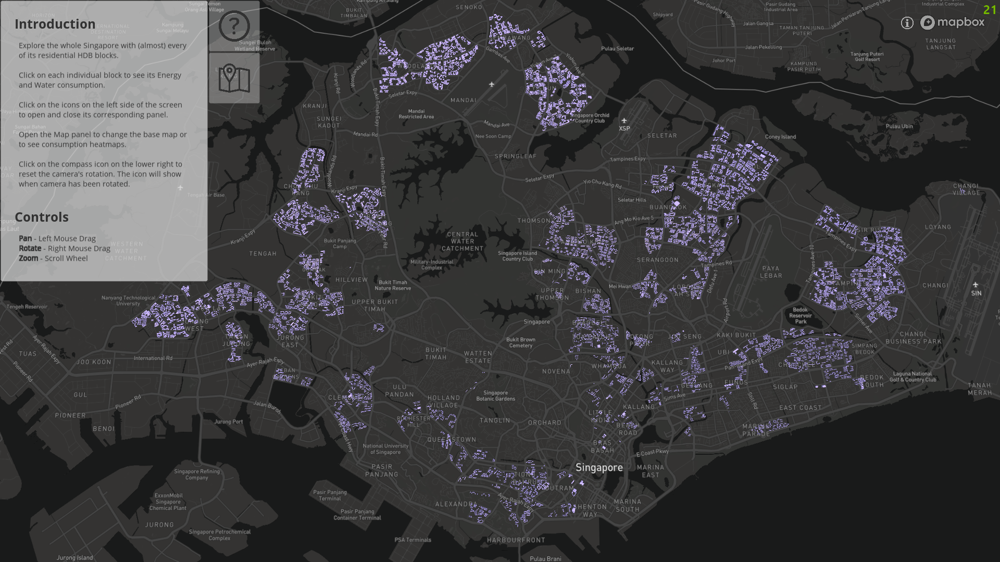
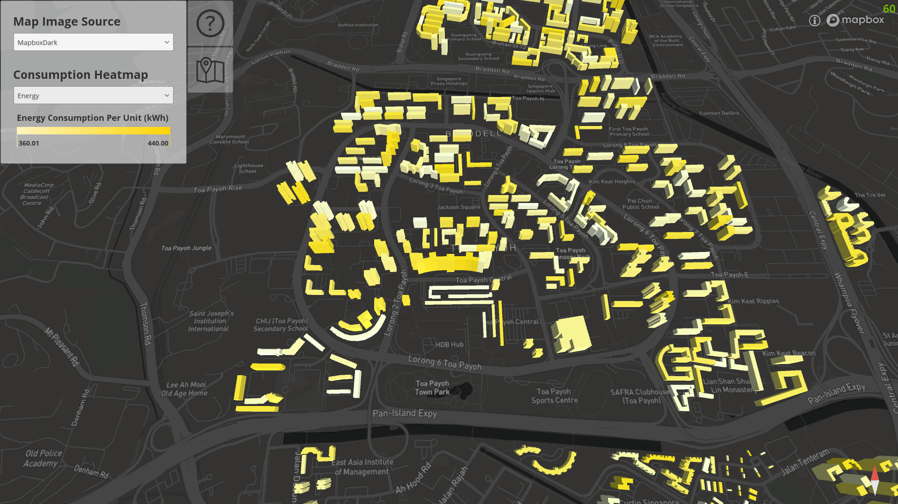
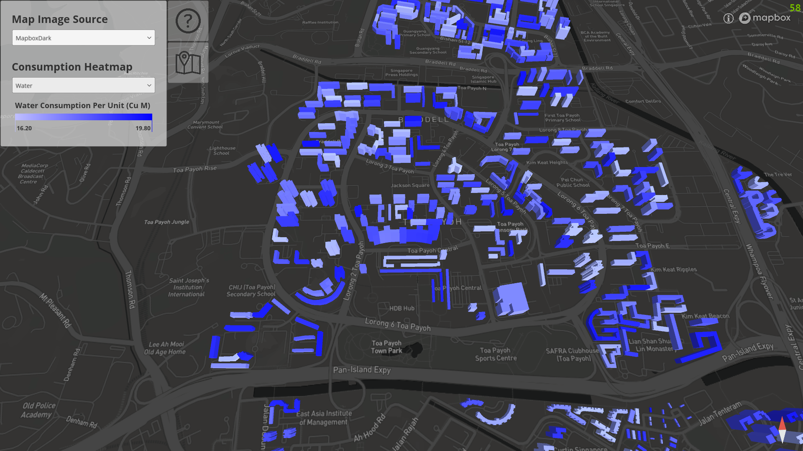
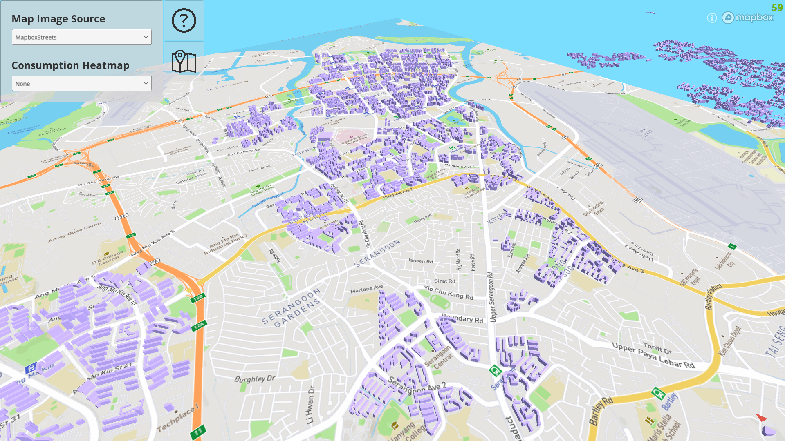

# George's Unity Assessment

This app allows you to explore a map of Singapore with (almost) every of its residential HDB blocks.
The map system is leveraging Mapbox's Unity integration. The HDB blocks are generated from CityJSON files and exported to FBX.

You are able to pan, rotate, and zoom the map.
If you have rotated the camera, a compass will appear on the lower right of the screen. Click the compass to reset the rotation of the camera.
In the Map Panel, you are able to change the base map layer for the map.

You are able to click on each block to open a popup showing total Energy (kWh) and Water (Cu M) consumption for that block.
In the Map Panel, you are able to show a heatmap of Per Unit Energy Consumption or Water Consumption. Each building will be highlighted according to the gradient scale shown on the left panel.
All data is generated mock data.

### Screenshots

### Requirements

Software:
- [Unity](www.unity3d.com) 2022.3.7f1
  
### Setup
  
1. Open in Unity 2022.3.7f1 (or upgrade as needed)
2. Build and run